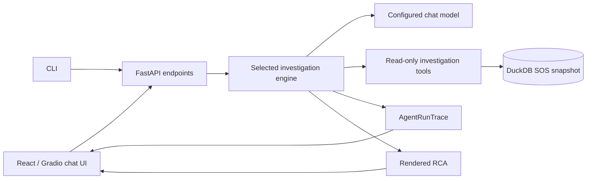
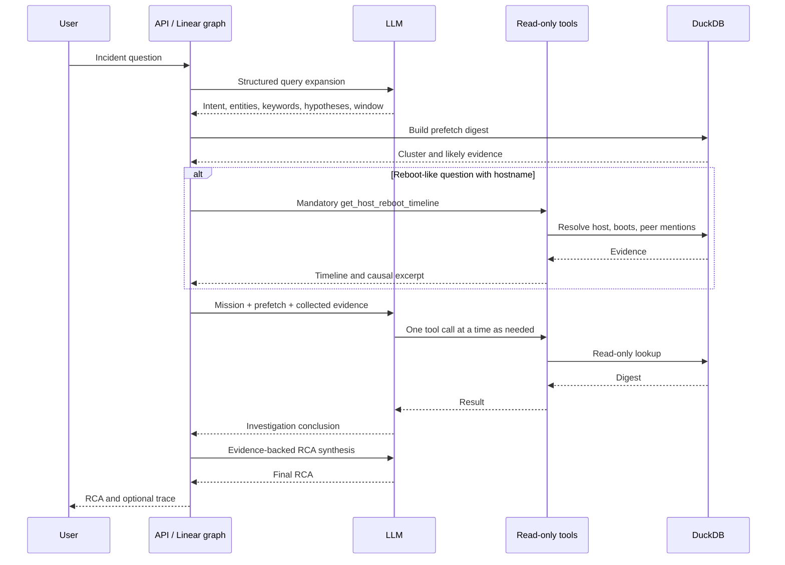
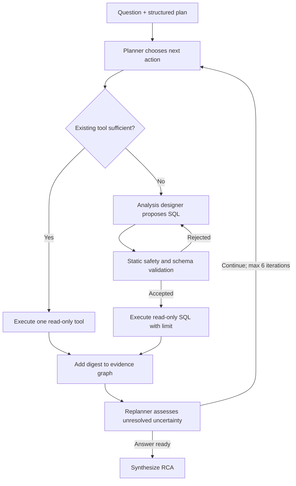

# How the Current Agentic AI RCA Agent Works

## Scope and operating model

The current application investigates RHOSP incidents from imported SOS report data. It does not connect to production OpenStack APIs, BMCs, hypervisors, or network equipment. Therefore, every conclusion is limited to what was captured in the SOS archives.

The UI and CLI can use either of two LLM-backed engines:

| Engine | Default | Design | Best fit |
| --- | --- | --- | --- |
| Linear investigator | Yes | Structured query expansion → tool-calling investigator → RCA synthesis | Most host, VM, port, and reboot questions |
| Planner investigator | Optional (`--engine planner`) | Planner → existing tool or validated custom SQL → evidence graph → replan | Questions requiring grouped, filtered, or otherwise novel analysis |

An offline deterministic workflow is also available when no LLM should be used.

## System architecture

## Data prepared during ingestion

The ingestion pipeline extracts SOS command output and logs into DuckDB. Important logical datasets include:

- `cluster_nodes`: cluster membership, hostname, node role, version, and archive identity.
- `os_logs`: timestamped operating-system and service log records.
- `os_commands`: captured command output, including systemd and journal artifacts.
- `entities`, `entity_mentions`, and `entity_relationships`: normalized identifiers and observed links for hosts, VMs, ports, requests, volumes, and networks.

The database is an evidence snapshot. “Observed” means observed in the archived data; it must not be described as current live state.

## Linear investigator — detailed execution

### 1. Structured query expansion

`ExpandedQuery` constrains model output to short, validated fields:

- incident summary and intent;
- hostname, resource ID/type, service, node role, and problem;
- bounded keywords, hypotheses, investigation targets, search tasks, and time window.

The application validates and sanitizes the model output. If structured output fails, it attempts to salvage usable JSON and finally uses a deterministic fallback plan.

### 2. Evidence prefetch

`prefetch_investigation_digest` retrieves compact, high-recall context before the agent begins. This improves speed and helps the model select an appropriate first tool. Prefetch is supporting context; the investigation still requires direct tool evidence where needed.

### 3. Tool investigation

The investigator receives a mission and access to read-only LangChain tools. Typical tools include:

| Tool | Purpose |
| --- | --- |
| `get_cluster_overview` | Resolve cluster members and roles. |
| `get_host_reboot_timeline` | Find boot boundaries and peer-host evidence in the boot gap. |
| `search_peer_mentions` | Search other nodes for a host’s monitor, state, fence, or evacuation events. |
| `search_os_logs` | Search raw local or scoped logs. |
| `get_entity_evidence` | Retrieve indexed evidence for a canonical host, VM, port, volume, or request ID. |
| `get_related_entities` / `get_operation_path` | Follow observed OpenStack relationships and operation paths. |
| `compare_nodes` | Compare service/error activity across ingested nodes. |
| `create_and_run_analysis` | Run a temporary, controlled analysis when no existing tool directly answers the question. |

The prompt instructs the model to use one native tool call at a time and to choose the next call that most reduces uncertainty. Provider-specific recovery handles malformed Groq tool-call output where possible.

### 4. Mandatory reboot evidence path

For a reboot, crash, panic, watchdog, or power-off question, the graph detects the reboot intent and first runs `get_host_reboot_timeline` itself when it has a hostname. This prevents a model from silently skipping the investigation and producing an RCA using only prefetch context.

The reboot helper:

1. Resolves a short hostname to its canonical cluster hostname.
2. Reads `journalctl --list-boots` first; falls back to journal bounds and other captured system artifacts.
3. Calculates a window around the prior boot end and current boot start.
4. Searches **other** cluster nodes for mentions of the exact host.
5. Prioritizes monitor connection loss and node-state loss before reboot/fencing completion events.
6. Retains a compact chain containing boot time, trigger, Pacemaker action, and unfencing when present.

This allows the RCA to say whether the host locally crashed, whether the cluster fenced it, and whether the actual initiating failure is absent from the capture.

### 5. RCA synthesis

The synthesis prompt receives the raw question, interpreted plan, gathered evidence, prefetch, and investigator notes. It is instructed to:

- answer the actual question first;
- state boot time first for reboot incidents;
- cite hostnames, IDs, timestamps, and direct log evidence where possible;
- prefer direct local or peer evidence over generic explanations;
- distinguish facts from hypotheses; and
- explicitly state missing evidence instead of inventing a cause.

## Planner engine — detailed execution

The planner engine is an alternative for questions that do not fit a single existing tool.

The planner accepts only one-statement `SELECT` or `WITH … SELECT` queries, requires a limit, validates schema references, and rejects mutating or administrative SQL. This protects the SOS snapshot from agent-generated SQL.

## Observability and auditability

`AgentRunTrace` records the investigation as structured events. The trace includes:

- run start/end and elapsed duration;
- graph node starts and ends;
- LLM start/end events by stage;
- tool name, arguments, output digest, and duration;
- graph handoffs between components;
- recovery and fallback events; and
- final RCA generation.

This makes “zero tool results” observable and diagnosable. It also lets operators differentiate an evidence-backed RCA from a response produced after an agent failure or fallback.

## Reliability boundaries and recommended interpretation

| What the agent can establish | What it cannot establish without captured evidence |
| --- | --- |
| A reboot time from boot records | The physical reason a host lost power or communication |
| Pacemaker monitor loss, state loss, fencing, and unfencing | Whether a network path, hardware component, BMC, or operator action caused that loss |
| Cross-node order of recorded events | Events absent from the SOS collection window |
| Entity relationships observed in logs | Live OpenStack inventory, telemetry, or current health |

An RCA should therefore use this confidence model:

1. **Direct cause** — the action directly recorded, for example Pacemaker fenced a node.
2. **Trigger** — the preceding observed condition, for example the remote monitor connection dropped.
3. **Underlying root cause** — only assert this when evidence identifies why the trigger occurred.
4. **Open gap** — name the missing log, telemetry, or external system needed when step 3 cannot be established.

## Current `comp008` example

For the captured incident, the agent should report:

- **Trigger:** Pacemaker Remote monitoring lost its connection to `n1-wrkld1-b1-b12-comp008` at `02:33:45`.
- **Direct cause of reboot:** Pacemaker marked the node lost and executed a STONITH reboot at `02:34:47`.
- **Observed recovery:** the next boot began at `02:38:27`; later unfencing was recorded.
- **Underlying cause:** not proven by the available SOS reports. The capture does not show why the remote connection dropped.

