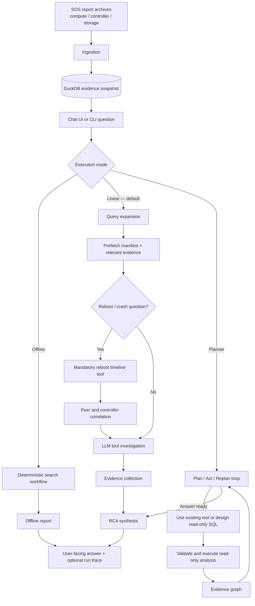
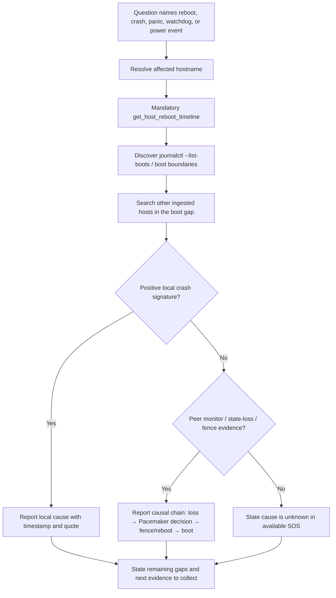
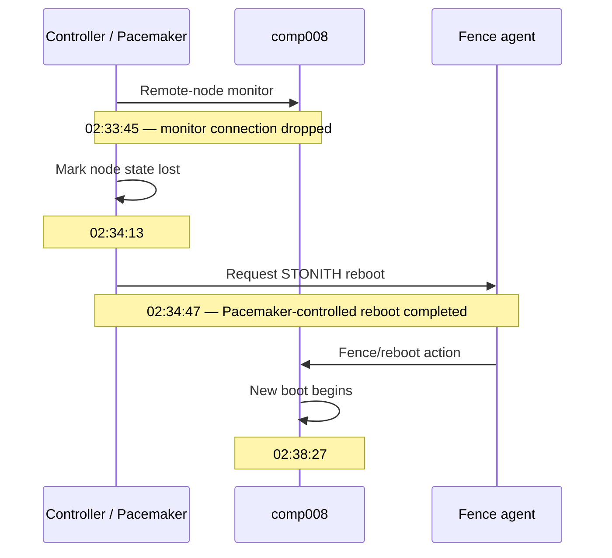

# OpenStack SOS RCA Agent — End-to-End Working Flow

## Purpose

The RCA Agent turns one or more Red Hat OpenStack SOS reports into an evidence-backed incident answer. It is an investigation assistant: it reads the ingested SOS snapshot, correlates evidence across nodes, and states only conclusions supported by that snapshot.

## Complete operational flow

## Phase-by-phase flow

| Phase | What happens | Output / control |
| --- | --- | --- |
| 1. Ingest | SOS archives are parsed and normalized into host, log, command, entity, and relationship records. | A local DuckDB snapshot. The agent does not query live OpenStack services. |
| 2. Receive question | The chat UI calls `/api/ask`; CLI calls `main.py analyze`. The user asks about a host, VM, port, operation, or error. | Raw incident question and selected engine. |
| 3. Query expansion | The LLM creates a bounded structured plan: intent, entities, hostname, service, keywords, hypotheses, and time window. Fallback parsing protects against invalid provider output. | `ExpandedQuery`. |
| 4. Prefetch | The application retrieves a compact cluster and evidence digest before the tool loop begins. | Fast initial context; it is not treated as a substitute for required evidence tools. |
| 5. Investigation | The agent calls read-only investigation tools one at a time. A reboot question has a mandatory first timeline call. | Tool digests and an observable tool trail. |
| 6. Correlation | Local logs are compared with peer/controller logs in the same time window. Entity and relationship tools link VM, port, request, and host evidence. | A causal timeline, or a clearly stated evidence gap. |
| 7. Synthesis | A final LLM call creates a concise RCA from the original request, evidence, and limitations. | Facts, direct cause, supported root cause, and remaining uncertainty. |
| 8. Presentation | The UI displays the RCA. Observability can display node transitions, LLM calls, tool calls, and handoffs. | Auditable response rather than hidden reasoning. |

## Reboot RCA decision flow

## Example: `comp008` reboot

This proves that Pacemaker fenced the node after monitoring lost the remote connection. It does **not** by itself prove why that connection was lost; the RCA must retain that distinction.

## Guardrails that make the answer trustworthy

- All investigation tools and temporary analyses use the ingested snapshot in read-only mode.
- Reboot investigations cannot finish with zero evidence-tool calls when a hostname is identified.
- Peer evidence prioritizes the exact resolved hostname, avoiding confusion with similarly named hosts in other racks.
- Monitor-loss and state-loss signals are ordered before fence completion messages, so the response retains trigger and action.
- The response must distinguish observed facts, supported inference, and unknowns.
- Missing local crash evidence is reported as “not found in available SOS,” not converted into an unsupported BMC, hardware, or manual-reset claim.

## Entry points

- Interactive UI: `python main.py chat`
- CLI investigation: `python main.py analyze "why comp008 rebooted"`
- Default engine: `linear` — query expansion → tool agent → synthesis.
- Optional engine: `planner` — iterative planner with validated, read-only DuckDB analysis when existing tools are insufficient.

